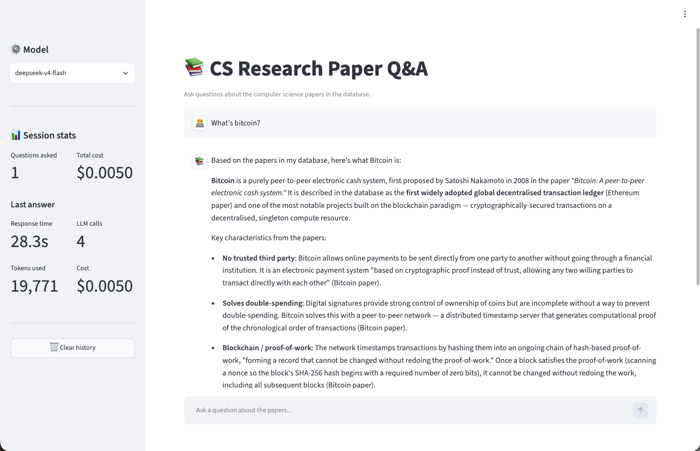
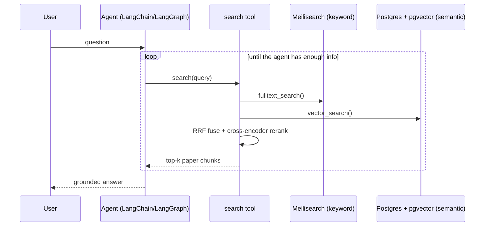
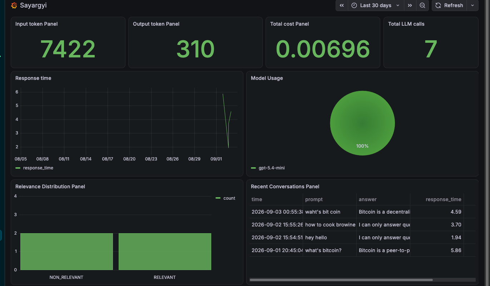

# Sayargyi — CS Research Paper Q&A

Sayargyi is a Retrieval-Augmented Generation (RAG) agent that answers
questions about computer science research papers. Ask it something like *"How does Raft achieve
leader election?"* or *"What is the time complexity of a wait-free queue?"* and it searches a
corpus of 400+ CS papers, then answers using only what it finds — it won't make things up, and
it won't answer questions outside its paper database.

**Live app:** https://sayargyi.space &nbsp;•&nbsp; **Live dashboard:**
[Grafana Cloud](https://minsanwork.grafana.net/public-dashboards/a8412f0b95e84a8d94ea966e457bf69e?from=now-30d&to=now&timezone=browser)

## Table of contents

- [Problem](#problem)
- [Demo](#demo)
- [How it works](#how-it-works)
- [Dataset](#dataset)
- [Architecture](#architecture)
- [Evaluation](#evaluation)
- [Monitoring](#monitoring)
- [Deployment](#deployment)
- [Getting started](#getting-started)
- [Usage examples](#usage-examples)
- [Project structure](#project-structure)
- [Evaluation criteria](#evaluation-criteria)
- [Limitations & ideas for improvement](#limitations--ideas-for-improvement)

## Problem

Reading through hundreds of research papers to answer a specific question ("does this paper cover
Byzantine fault tolerance?", "what's the eviction policy used here?") is slow. Plain full-text
search misses paraphrased questions, and asking an LLM directly risks hallucinated answers with no
grounding in the actual papers.

Sayargyi solves this by combining:

- **Hybrid retrieval** — keyword search (Meilisearch) + semantic search (pgvector embeddings),
  merged with Reciprocal Rank Fusion and reordered with a cross-encoder reranker.
- **A tool-calling agent** — an LLM (OpenAI or DeepSeek) that repeatedly searches, reads the
  results, and decides whether to search again before answering, instead of answering from
  memory.
- **Guardrails** — the agent is instructed to only use retrieved content and to refuse questions
  that aren't about computer science research.

## Demo

The app is a Streamlit chat UI, live at **https://sayargyi.space**. It shows the answer plus
per-question stats (response time, tokens, cost) and lets you expand each answer to see the exact
search calls the agent made.


*(Run the app locally and drop a screenshot here — see [`app.py`](app.py). Streamlit's
top-right menu also lets you record a short screen capture of a session.)*

## How it works



1. **Ingestion** ([`ingest/ingest.py`](ingest/ingest.py)) splits each paper into chunks (by
   markdown headers, then by size), indexes them in Meilisearch, and embeds them with a
   `sentence-transformers` model for pgvector.
2. **Retrieval** ([`tools.py`](tools.py)) runs both keyword and vector search, fuses the two
   ranked lists with Reciprocal Rank Fusion, then reranks the fused candidates with a
   cross-encoder before returning results to the agent.
3. **Agent** ([`rag.py`](rag.py)) is a `langchain`/`langgraph` tool-calling agent that is
   restricted to one search call per turn, so it can look, think, and search again before
   answering.
4. **UI** ([`app.py`](app.py)) is a Streamlit chat app that lets you pick a model
   (`gpt-5.4-mini`, `gpt-5-nano`, `deepseek-v4-flash`, `deepseek-v4-pro`) and shows cost/latency
   per answer.

## Dataset

[`papers/`](papers) contains 426 papers across 67 topics (e.g. `distributed_systems`,
`artificial_intelligence`, `cryptography`, `operating_systems`, `computer_vision`). Each paper is
a JSON file (`<topic>__<paper-slug>.json`) with `title`, `tags`, `content`, and `source_pdf`
fields, which `ingest/ingest.py` chunks and indexes.

## Architecture

| Component | Role |
|---|---|
| **Streamlit** (`app.py`) | Chat UI |
| **LangChain / LangGraph** (`rag.py`) | Tool-calling RAG agent |
| **Meilisearch** | Full-text/keyword search over paper chunks |
| **Postgres + pgvector** | Vector similarity search + logs of conversations/feedback |
| **sentence-transformers (ONNX)** | Embeddings for vector search |
| **cross-encoder reranker** | Reorders fused search results by relevance |
| **OpenAI / DeepSeek** | LLM providers for the agent and the judge |
| **Grafana** | Dashboards over conversation/feedback data in Postgres |
| **AWS (ECS Fargate, RDS, ALB, Route 53)** | Production hosting, provisioned with Terraform |

All services are wired up in [`docker-compose.yml`](docker-compose.yml) for local development, and
in [`terraform/`](terraform) for the AWS deployment.

## Evaluation

Evaluation is split into two parts, both under [`evaluations/`](evaluations):

**Retrieval evaluation** ([`search_eval.ipynb`](evaluations/search_eval.ipynb), against
[`ground_truth.csv`](evaluations/ground_truth.csv)) — measures **hit rate** and **MRR** across
different Meilisearch/pgvector configurations (search attributes, ranking rules, hybrid weights,
top-k, with/without reranking). Best config found: hybrid search with weights `[0.25, 0.75]`
(keyword, vector) plus cross-encoder reranking, which gave hit rate ≈ 1.0 and MRR ≈ 0.92–0.95.

**Answer/agent evaluation** ([`agent-evaluation.ipynb`](evaluations/agent-evaluation.ipynb),
[`llm_eval.ipynb`](evaluations/llm_eval.ipynb)) — an LLM-as-a-judge
([`judge.py`](judge.py)) classifies each generated answer as `RELEVANT`, `PARTLY_RELEVANT`, or
`NON_RELEVANT` given the question and answer, producing a relevance score (1 / 0.5 / 0). This is
run across models (`gpt-5.4-mini`, `gpt-5-nano-2025-08-07`, `deepseek-v4-flash`,
`deepseek-v4-pro`) and against deliberately degraded configs (`*-tool-bad`, `*-search-bad` CSVs)
to sanity-check that the judge and evaluation pipeline actually detect worse answers.

Both users and the judge can leave feedback ([`db/query.py`](db/query.py) `save_feedback`) which
is stored alongside each conversation for the Grafana dashboard. In the Streamlit app, every answer
has 👍/👎 buttons so users can rate it directly.

## Monitoring

`docker-compose.yml` runs a Grafana instance (`localhost:3000`, default login `admin`/`admin`)
provisioned with a dashboard ([`grafana/dashboards/dashboard.json`](grafana/dashboards/dashboard.json))
reading from Postgres, showing:

- Response time
- Model usage
- Relevance distribution (from judge + user feedback)
- Recent conversations
- User feedback (collected via the 👍/👎 buttons in the app, and from the judge)
- Input token usage

The production dashboard is public on Grafana Cloud



## Deployment

Sayargyi is deployed live on AWS and reachable at **https://sayargyi.space**. The whole stack
(container registry, ECS Fargate service, managed Postgres, load balancer with HTTPS, DNS) is
defined as infrastructure-as-code with Terraform under [`terraform/`](terraform), so it can be
stood up with `terraform apply` from `terraform/environmnets/prod`. The public monitoring
dashboard is hosted on Grafana Cloud (linked above).

## Getting started

### Prerequisites

- Docker (for Postgres/pgvector, Meilisearch, and Grafana)
- Python 3.12+ and [`uv`](https://docs.astral.sh/uv/)
- An OpenAI API key and/or a DeepSeek API key, depending on which models you want to use

### 1. Configure environment variables

Create a `.env` file in the project root:

```bash
OPENAI_API_KEY=sk-...
DEEPSEEK_API_KEY=...

POSTGRES_HOST=localhost
POSTGRES_DB=sayargyi
POSTGRES_USER=postgres
POSTGRES_PASSWORD=postgres

MEILI_HOST=http://localhost:7700
MEILI_MASTER_KEY=masterkey
```

### 2. Start the infrastructure

```bash
docker compose up -d db meilisearch grafana
```

This starts Postgres (with the `pgvector` extension), Meilisearch, and Grafana.

### 3. Install dependencies

```bash
uv sync
```

### 4. Initialize the database

```bash
uv run python -m db.init_db
```

This creates the `paper_chunks`, `conversations`, and `feedback` tables.

### 5. Ingest the papers

You have two options. **The snapshot restore is strongly recommended** — re-embedding 400+ papers
from scratch is slow, whereas restoring the pre-built snapshot takes seconds.

#### Option A — Restore the snapshot (recommended)

The committed snapshot in [`snapshots/`](snapshots) captures the already-ingested data from both
stores (Postgres `paper_chunks` with pgvector embeddings, and the Meilisearch index). Restore it
instead of running ingestion:

```bash
# 1. Postgres: load rows (truncate first so re-imports don't duplicate)
docker compose exec -T db psql -U postgres -d sayargyi -c "TRUNCATE paper_chunks"
gunzip -c snapshots/paper_chunks.sql.gz | docker compose exec -T db psql -U postgres -d sayargyi

# 2. Meilisearch: create the index, apply settings, then load documents
curl -s -X POST http://localhost:7700/indexes \
  -H "Authorization: Bearer ${MEILI_MASTER_KEY:-masterkey}" \
  -H "Content-Type: application/json" \
  --data '{"uid":"paper_chunks","primaryKey":"id"}'

curl -s -X PATCH http://localhost:7700/indexes/paper_chunks/settings \
  -H "Authorization: Bearer ${MEILI_MASTER_KEY:-masterkey}" \
  -H "Content-Type: application/json" \
  --data-binary @snapshots/meili_settings.json

gunzip -c snapshots/meili_documents.ndjson.gz | curl -s -X POST \
  "http://localhost:7700/indexes/paper_chunks/documents?primaryKey=id" \
  -H "Authorization: Bearer ${MEILI_MASTER_KEY:-masterkey}" \
  -H "Content-Type: application/x-ndjson" \
  --data-binary @-
```

Meilisearch processes updates asynchronously — confirm the tasks succeeded before running the app:

```bash
curl -s "http://localhost:7700/tasks?limit=5" \
  -H "Authorization: Bearer ${MEILI_MASTER_KEY:-masterkey}"
```

See [`snapshots/README.md`](snapshots/README.md) for details and for how to regenerate the
snapshot.

#### Option B — Ingest from source

Only needed if you've changed the papers or the chunking/embedding logic. This chunks every paper
in [`papers/`](papers), indexes them in Meilisearch, and embeds them for vector search:


### 6. Run the app

Either run it directly:

```bash
uv run streamlit run app.py
```

Or build and run it as a container alongside the rest of the stack (uses the
[`Dockerfile`](Dockerfile)):

```bash
docker compose up -d --build app
```

Open the URL Streamlit prints (usually `http://localhost:8501`).

## Usage examples

Ask questions in the chat box, for example:

- *"What consensus algorithm does Raft use for leader election?"*
- *"Compare wait-free and lock-free algorithms for a queue."*
- *"What's the difference between hit rate and MRR in retrieval evaluation?"*

Switch models from the sidebar to compare cost/latency/answer quality. Questions unrelated to CS
research (e.g. "what's the weather today?") are refused by design, since the agent only answers
from retrieved paper content.

To reproduce the offline evaluations instead of using the UI:

```bash
uv run jupyter notebook evaluations/search_eval.ipynb      # retrieval: hit rate / MRR
uv run jupyter notebook evaluations/agent-evaluation.ipynb # agent answers + LLM-as-judge
```

## Project structure

```
app.py               Streamlit chat UI
rag.py                RAG agent (LangChain/LangGraph), usage/cost tracking
tools.py              Hybrid search tool: Meilisearch + pgvector + RRF + reranker
judge.py              LLM-as-a-judge relevance evaluation
main.py               Example script: run a query, log it, and record feedback
db/                    Postgres connection, schema init, conversation/feedback queries
ingest/ingest.py       Chunk papers, index in Meilisearch, embed for pgvector
papers/                426 CS paper JSON files (source corpus)
evaluations/           Ground truth, retrieval eval, agent/LLM eval notebooks and results
grafana/               Provisioned dashboard + datasource for monitoring
snapshots/             Pre-built corpus snapshot (Postgres + Meilisearch) to skip ingestion
terraform/             AWS infra as code: ECR, ECS Fargate, RDS, ALB, ACM, Route 53
Dockerfile             Container image for the Streamlit app
docker-compose.yml     App, Postgres/pgvector, Meilisearch, Grafana services
```

## Limitations & ideas for improvement

- No conversation memory across questions (each question is answered independently).
- Reranking runs on CPU with a small cross-encoder; latency could be improved with a hosted
  reranker for larger `num_results`.
